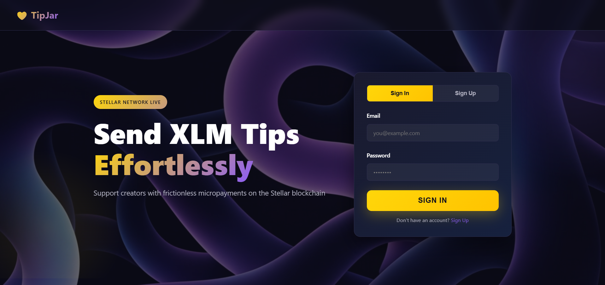
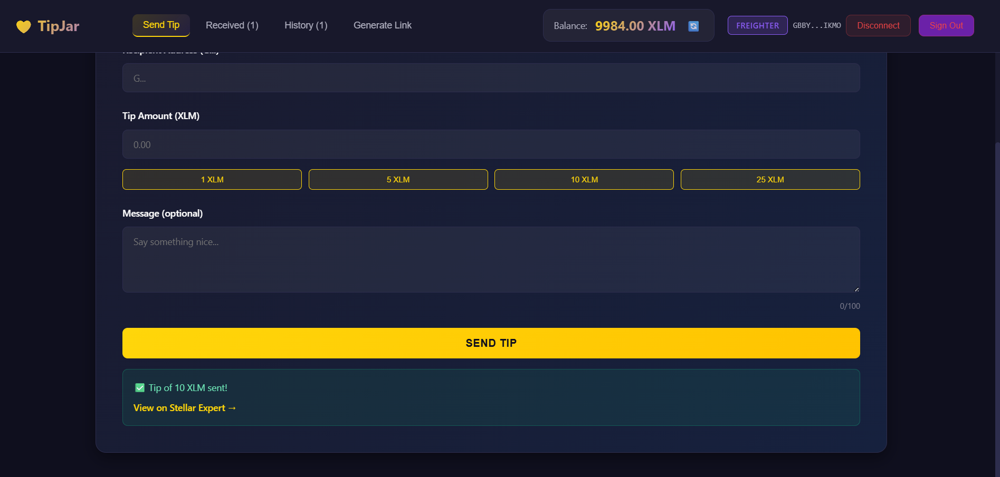
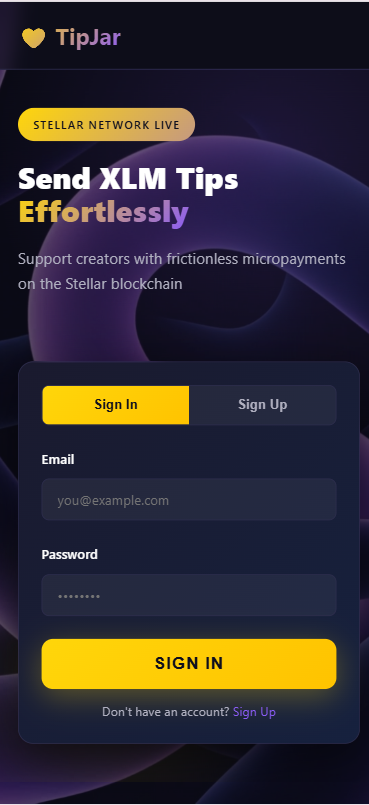

💸 TipJar
Welcome to TipJar! TipJar is a user-friendly platform designed to simplify peer-to-peer crypto tipping on the Stellar network.
Users can securely connect their Albedo or Freighter wallets to send XLM directly to others or generate custom tipping links based on their username or wallet address.
With built-in transaction history and direct links to the Stellar Explorer for blockchain verification, TipJar ensures that every tip is fast, secure, and transparent.

📸 Screenshots

### Home Page

### Dashboard

### Mobile Response 

### Demo Video : 
https://youtu.be/s69QlMkR_3Y

### Deployed Vercel Link: 
https://tip-jar-green.vercel.app/

✨ Features
FeatureDescription🔐 Secure AuthEmail/password sign-up & sign-in via Firebase Authentication
👛Wallet IntegrationConnect with Albedo or Freighter Stellar wallets in one click
🔗 Custom Tip LinksGenerate a shareable tipjar.app/@yourusername link tied to your wallet
🐦 Social SharingBuilt-in Twitter share button for your tip link
⚡ Quick Tip AmountsPre-set buttons for 1, 5, 10, 25 XLM — or enter any custom amount
💬 Tip MessagesSenders can include an optional personal message with every tip
📊 Transaction DashboardReal-time view of all sent and received tips
🔍 Blockchain VerificationDirect link to Stellar Expert / Horizon for every transaction
📜 On-Chain LoggingTips logged to a Soroban smart contract on Stellar
🌐 Testnet ReadyRuns on Stellar Testnet — switch to mainnet by changing one config line

🚀 Quick Start
Prerequisites

Node.js v18+
A Firebase project (Firestore + Authentication enabled)
Albedo or Freighter browser extension

Installation
bash# 1. Clone the repository
git clone https://github.com/Shuvankar11/tipjar.git
cd tipjar

# 2. Install dependencies
npm install

# 3. Configure Firebase
#    Open app-final.js and replace the firebaseConfig object with your own credentials

# 4. Start the development server
npm start
Open your browser at http://localhost:8080 🎉

🛠️ Tech Stack
LayerTechnologyFrontendReact 18 (via CDN + SystemJS), Vanilla CSSBackend / AuthFirebase Authentication,
FirestoreBlockchainStellar Network (Testnet), Stellar SDK v10Smart ContractSoroban (Rust) — deployed on Stellar TestnetWallet SupportAlbedo, 
FreighterServerNode.js HTTP server (static file serving)HostingVercelCI/CDGitHub Actions

📁 Project Structure
TipJar/
├── app-final.js              # Main React app (all components)
├── index.html                # Entry HTML — loads CDN scripts
├── style-final.css           # Global styles (glassmorphism, gradients)
├── server.js                 # Node.js static file server (SPA routing)
├── config.js                 # SystemJS / module loading config
├── vercel.json               # Vercel deployment config
├── package.json              # Dependencies & scripts
├── contracts/
│   └── tipjar/
│       ├── Cargo.toml        # Rust crate config
│       └── src/
│           └── lib.rs        # Soroban smart contract
├── tests/
│   └── app.test.js           # Unit tests
└── .github/
    └── workflows/
        └── deploy.yml        # GitHub Actions CI (test on push)

⚙️ Configuration
// Mainnet
const HORIZON_URL = 'https://horizon.stellar.org';
const NETWORK_PASSPHRASE = 'Public Global Stellar Network ; September 2015';

📜 Smart Contract
The Soroban contract (contracts/tipjar/src/lib.rs) lives on the Stellar Testnet:
Contract ID: CBYSZTMUNI6TTNRKOJPK2424CSQF6H52QARHDBYCNYVM5OVEJB7YYMCR
Functions:
FunctionDescriptionlog_tip(sender, amount, message)Records a tip on-chain; 
requires sender authget_tips()Returns all logged tip entriesget_total()Returns cumulative tips in stroops.

Build the contract:
bashcd contracts/tipjar
cargo build --target wasm32-unknown-unknown --release

🔄 How It Works

User signs up / signs in via Firebase Auth
Connect wallet — Albedo or Freighter via browser extension
Send a tip — choose a recipient by wallet address or /@username, pick an amount, add an optional message, confirm in your wallet
On-chain — a Stellar payment operation transfers XLM; a Soroban contract call logs the tip
Dashboard — Firestore stores metadata; the dashboard shows real-time sent/received history with Horizon explorer links

🧪 Running Tests
bashnpm test
Tests are located in tests/app.test.js and run with plain Node.js (no test framework dependency).

📄 License
Distributed under the MIT License. See LICENSE for details.

🙏 Acknowledgments

Stellar Development Foundation — for the Stellar network & Soroban SDK
Albedo & Freighter — wallet integrations
Firebase — authentication & database

Made with ❤️ and ☕ — Star the repo if you found it useful!
⭐ Star on GitHub ⭐

