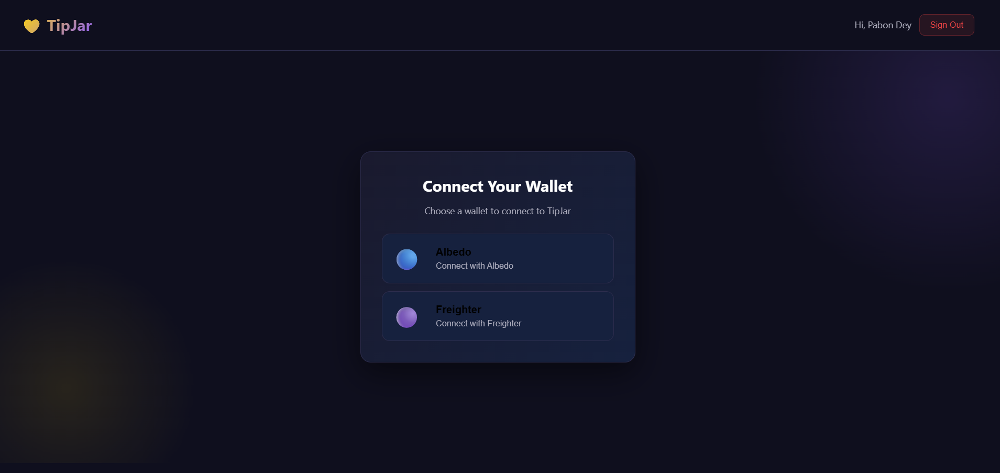

💸 TipJar
<div>
Welcome to TipJar! TipJar is a user-friendly platform designed to simplify peer-to-peer crypto tipping on the Stellar network.
Users can securely connect their Albedo or Freighter wallets to send XLM directly to others or generate custom tipping links based on their username or wallet address.
With built-in transaction history and direct links to the Stellar Explorer for blockchain verification, TipJar ensures that every tip is fast, secure, and transparent.


</div>

📸 Screenshots

### Home Page


### Dashboard


### Mobile Response 


### Different Wallet Option


*** For more screenshots check Screenshots folder ***

### Demo Video : 
https://youtu.be/s69QlMkR_3Y


### Deployed Vercel Link: 
https://tip-jar-green.vercel.app/


## 5+ User Wallet Addresses (Verified on Stellar Testnet)
| User | Stellar Address |
|------|----------------|
| User 1 | GAQFPTYZEI5RCBURZ7OAMGJYO6NHS7VYWZTNNYEPUOKU7QK5FELPOIYD |
| User 2 | GDU34BU5VFLXSZHM5K4D737TYU6XBATENI5RXCI54UKERV6NITMSWJHT |
| User 3 | GAYUFZJBWTK3T5ZX47DILF43QUGPYFNIPBVTLYLF3CYVJVF54MCSS3G3 |
| User 4 | GCVTL7ISWO52Q5GCOEVZQ5Z77ZN5EFC2N2RNM4IVVVJMILZZ2Q4PVAAJ |
| User 5 | GAJHZLYDEWNHJVG63A3BWAGPHRAR4WQXHRA6QXTBA34MJGGSCRPJWYTP |
| User 6 | GB4EU73SY2J7KJAMTSZCFUER7XKMRUFR3IE3NWDNSFO754EIWUH5ITAB |


## Contract Information
| Item | Value |
|------|-------|
| Network | Stellar Testnet |
| Contract ID | `CBYSZTMUNI6TTNRKOJPK2424CSQF6H52QARHDBYCNYVM5OVEJB7YYMCR` |
| Deploy TX Hash | `2b5531aa88f390dd9b5eeb88ba57e885e233ebcb4d449fb7b66071fa48c8c0f7` |
| Stellar Explorer | [View Contract](https://stellar.expert/explorer/testnet/contract/CBYSZTMUNI6TTNRKOJPK2424CSQF6H52QARHDBYCNYVM5OVEJB7YYMCR) |


## CI/CD
This project uses GitHub Actions for automated deployment to Vercel.
Every push to main triggers a build and deploy.

### User Feedback Form: 
 [give feedback](https://docs.google.com/forms/d/e/1FAIpQLSe7byMbZPbgFgVM2gUTxNllAlldho8ZWWgH2JTjfb-2Vhg26w/viewform?usp=publish-editor).

 [View User Feedback Document](https://docs.google.com/spreadsheets/d/1Y8JrN8sZV8SKP3HgzJpzHoWpP51v1aHbCFU79XomnLI/edit?usp=sharing)


✨ Features
FeatureDescription🔐 Secure AuthEmail/password sign-up & sign-in via Firebase Authentication
👛Wallet IntegrationConnect with Albedo or Freighter Stellar wallets in one click
🔗 Custom Tip LinksGenerate a shareable tipjar.app/@yourusername link tied to your wallet
🐦 Social SharingBuilt-in Twitter share button for your tip link
⚡ Quick Tip AmountsPre-set buttons for 1, 5, 10, 25 XLM — or enter any custom amount
💬 Tip MessagesSenders can include an optional personal message with every tip
📊 Transaction DashboardReal-time view of all sent and received tips
🔍 Blockchain VerificationDirect link to Stellar Expert / Horizon for every transaction
📜 On-Chain LoggingTips logged to a Soroban smart contract on Stellar
🌐 Testnet ReadyRuns on Stellar Testnet — switch to mainnet by changing one config line


## 🛠 Tech Stack

| Layer | Technology |
|---|---|
| Frontend | React 18 (JSX, loaded via SystemJS + Babel — no build step) |
| Server | Node.js `http` module (static file server) |
| Blockchain SDK | `stellar-sdk` v10.4.1 |
| Blockchain Network | Stellar Testnet / Mainnet |
| Wallet | Freighter & Albedo browser extensions |
| Database | Firebase Firestore (off-chain tip metadata) |
---


## ✅ Prerequisites

Make sure the following are installed on your Windows machine before you begin:

| Tool | Version | Download |
|---|---|---|
| **Node.js** | v18 or higher | https://nodejs.org |
| **Git** | Any recent version | https://git-scm.com |
| **Chrome or Edge** | Any modern version | (pre-installed) |
| **Freighter or Albedo** | Browser extension | https://freighter.app or https://albedo.link |

**Verify Node.js is installed** — open Command Prompt and run:

```bash
node --version
# Expected: v18.x.x or higher

npm --version
# Expected: 9.x or 10.x
```

---

## 🚀 Local Setup — Windows

### Step 1 — Clone the Repository

Open **Command Prompt** (`Win + R` → type `cmd` → Enter) and run:

```bash
# Navigate to your preferred folder
cd C:\Users\shuvankar\Projects

# Clone the repo (replace with your actual GitHub URL)
git clone https://github.com/Shuvankar11/TipJar.git

# Enter the project folder
cd TipJar
```

---

### Step 2 — Install Dependencies

```bash
npm install
```

This downloads `stellar-sdk` and all required packages into a `node_modules/` folder.  
**Expected output:** `added X packages in Xs` (no red errors)

> ⚠️ Yellow `WARN` messages are normal — only red `ERROR` messages need attention.

---

### Step 3 — Start the Local Server

```bash
npm start
```

**Expected output:**

```
TipJar running at http://127.0.0.1:8080
Press Ctrl+C to stop
```

> 🔴 **Keep this terminal window open.** Closing it stops the server.

---
*** For more details visit QUICK_START.md ***

⚙️ Configuration
// Mainnet
const HORIZON_URL = 'https://horizon.stellar.org';
const NETWORK_PASSPHRASE = 'Public Global Stellar Network ; September 2015';


Build the contract:
bashcd contracts/tipjar
cargo build --target wasm32-unknown-unknown --release

🔄 How It Works

User signs up / signs in via Firebase Auth
Connect wallet — Albedo or Freighter via browser extension
Send a tip — choose a recipient by wallet address or /@username, pick an amount, add an optional message, confirm in your wallet
On-chain — a Stellar payment operation transfers XLM; a Soroban contract call logs the tip
Dashboard — Firestore stores metadata; the dashboard shows real-time sent/received history with Horizon explorer links

### ARCHITECTURE: 
See Architechture.md for full design.

---

🙏 Acknowledgments

Stellar Development Foundation — for the Stellar network & Soroban SDK
Albedo & Freighter — wallet integrations
Firebase — authentication & database


<div align="center">
Made with ❤️ and ☕ — Star the repo if you found it useful!
⭐ Star on GitHub ⭐
</div>
